# Station Architecture

This document explains how Station works internally, how its components interact, and what it provides beyond Laravel Horizon.

For related documentation, see:
- **[Queue Drivers](drivers.md)** — Feature matrix, driver configs, and per-driver details
- **[Facades](facades.md)** — All 7 facades with every public method
- **[Security, Alerting & Resilience](security.md)** — API auth, encryption, masking, alerting, circuit breaker
- **[Configuration & Environment Variables](configuration.md)** — Full config reference and env var list
- **[Migrating from Horizon](migration.md)** — Step-by-step migration guide and feature mapping

---

## Table of Contents

- [Overview](#overview)
- [How Station Integrates with Laravel](#how-station-integrates-with-laravel)
- [Jobs](#jobs)
  - [Seamless Tracking](#seamless-tracking)
  - [Job Lifecycle](#job-lifecycle)
  - [What Station Records per Job](#what-station-records-per-job)
  - [Station Dispatch vs Laravel Dispatch](#station-dispatch-vs-laravel-dispatch)
- [Batches](#batches)
  - [How Batches Work](#how-batches-work)
  - [The Overlay Table Strategy](#the-overlay-table-strategy)
  - [Atomic Counter Tracking](#atomic-counter-tracking)
  - [Batch Lifecycle](#batch-lifecycle)
  - [Failure Thresholds](#failure-thresholds)
- [Workflows](#workflows)
  - [Simple Workflows](#simple-workflows)
  - [Full Workflow Engine](#full-workflow-engine)
  - [Workflow Execution Model](#workflow-execution-model)
  - [Row-Level Locking](#row-level-locking)
  - [Virtual Steps](#virtual-steps)
  - [Definition Step Snapshotting](#definition-step-snapshotting)
  - [Deadlock Detection](#deadlock-detection)
  - [Stuck Workflow Recovery](#stuck-workflow-recovery)
  - [Conditional Steps and Branching](#conditional-steps-and-branching)
  - [Context Propagation](#context-propagation)
- [Workers and Supervisor](#workers-and-supervisor)
  - [Supervisor Architecture](#supervisor-architecture)
  - [Worker Process](#worker-process)
  - [Signal Handling](#signal-handling)
  - [Memory and Time Limits](#memory-and-time-limits)
- [Recovery System](#recovery-system)
  - [Job Checkpointing](#job-checkpointing)
  - [Stuck Job Detection](#stuck-job-detection)
  - [Recovery Strategies](#recovery-strategies)
  - [Health Checks](#health-checks)
- [Metrics and Monitoring](#metrics-and-monitoring)
  - [What Station Measures](#what-station-measures)
  - [Per-Job Metrics](#per-job-metrics)
  - [Aggregate Metrics](#aggregate-metrics)
  - [Prometheus Export](#prometheus-export)
- [Dashboard](#dashboard)
  - [Pages](#pages)
  - [API Endpoints](#api-endpoints)
  - [Real-Time Refresh](#real-time-refresh)
- [Database Schema](#database-schema)
- [Job Middleware](#job-middleware)
  - [RateLimited](#ratelimited)
  - [Timeout](#timeout)
  - [Unique](#unique)
  - [WithoutOverlapping](#withoutoverlapping)
- [Testing](#testing)
  - [Available Assertions](#available-assertions)
- [Telemetry](#telemetry)
  - [Automatic Instrumentation](#automatic-instrumentation)
  - [Manual Instrumentation](#manual-instrumentation)
- [Auto-Scaling](#auto-scaling)
  - [Scaling Policy Builder](#scaling-policy-builder)
  - [Schedule-Based Scaling](#schedule-based-scaling)
- [Worker and Supervisor Events](#worker-and-supervisor-events)
- [Station vs Horizon](#station-vs-horizon)
  - [Feature Comparison](#feature-comparison)
  - [What Station Can Do That Horizon Cannot](#what-station-can-do-that-horizon-cannot)
  - [What Horizon Can Do That Station Cannot](#what-horizon-can-do-that-station-cannot)
  - [Architectural Differences](#architectural-differences)

---

## Overview

Station is a Laravel package that replaces Horizon as the queue management and monitoring layer. It provides:

- A custom worker and supervisor that fork child processes with `pcntl_fork()`
- Transparent job tracking via Laravel event listeners (no code changes needed)
- Batch management that wraps Laravel's native `Bus::batch()` with an overlay table for richer metadata
- A persistent workflow engine with conditional steps, branching, and pause/resume
- Job checkpointing and stuck job recovery
- A real-time Inertia.js + Vue 3 dashboard
- Multi-driver support: RabbitMQ (primary), Redis, SQS, Beanstalkd, Kafka

The key design principle: **your existing Laravel queue code works unchanged**. Station hooks into Laravel's queue event system to track everything transparently.

### High-Level Architecture

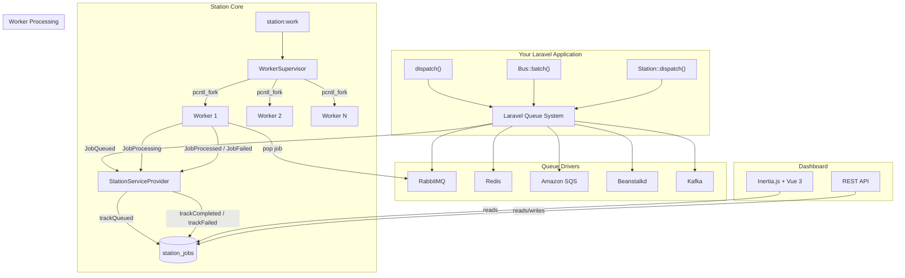

### Event Flow

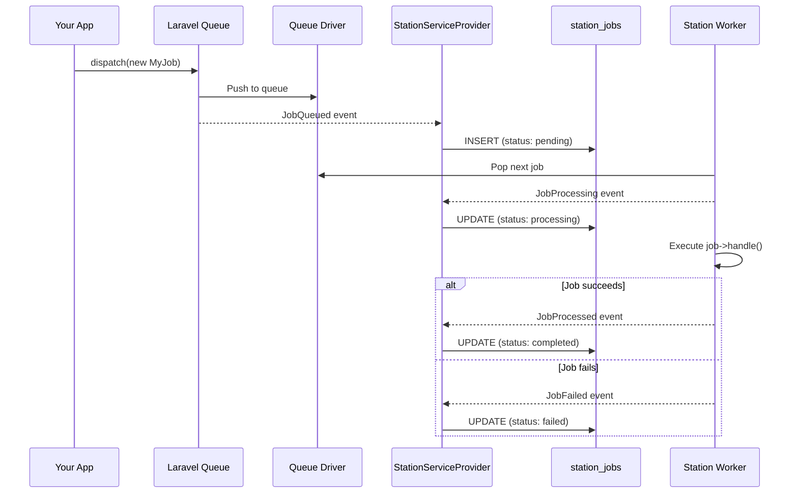

---

## How Station Integrates with Laravel

Station's `StationServiceProvider` registers listeners on four Laravel queue events:

| Laravel Event | Station Listener | What It Does |
|---|---|---|
| `JobQueued` | `trackQueued()` | Creates a record in `station_jobs` with status `pending` |
| `JobProcessing` | `trackProcessing()` | Updates status to `processing`, increments attempts |
| `JobProcessed` | `trackCompleted()` | Updates status to `completed`, records processing time. If the job belongs to a batch, calls `BatchManager::recordJobCompletion()` |
| `JobFailed` | `trackFailed()` | Updates status to `failed`, stores exception. If the job belongs to a batch, calls `BatchManager::recordJobFailure()` |

These listeners fire for **any** job dispatched through Laravel's queue system, whether via `dispatch()`, `Bus::dispatch()`, `Queue::push()`, or Station's own `Station::dispatch()`. No special traits or interfaces are required on jobs.

**Batch ID extraction**: When a job uses Laravel's `Batchable` trait, the listener deserializes the job payload and reads the `batchId` property from the trait. This connects individual job events to their parent batch.

**Station Job ID tracking**: Station generates a UUID7 for each job via `Job::create()`. Before pushing to the queue, it sets a `stationJobId` property on the job object. Event listeners extract this from the deserialized payload to correlate queue events back to the `station_jobs` record.

**Disabling tracking**: Set `station.tracking.enabled` to `false` in config to disable all event listeners. This prevents Station from recording job state changes, batch progress, and workflow metrics. Useful for testing or environments where tracking overhead is unwanted.

---

## Jobs

### Seamless Tracking

Standard Laravel dispatch works out of the box:

```php
// All of these are tracked by Station automatically
ProcessOrderJob::dispatch($order);
ProcessOrderJob::dispatch($order)->onQueue('high');
ProcessOrderJob::dispatch($order)->delay(now()->addMinutes(5));
```

Station also provides a fluent API via the `Station` facade:

```php
Station::job(new ProcessOrderJob($order))
    ->onQueue('high')
    ->delay(now()->addMinutes(5))
    ->tags(['orders', 'payments'])
    ->dispatch();
```

### Job Lifecycle

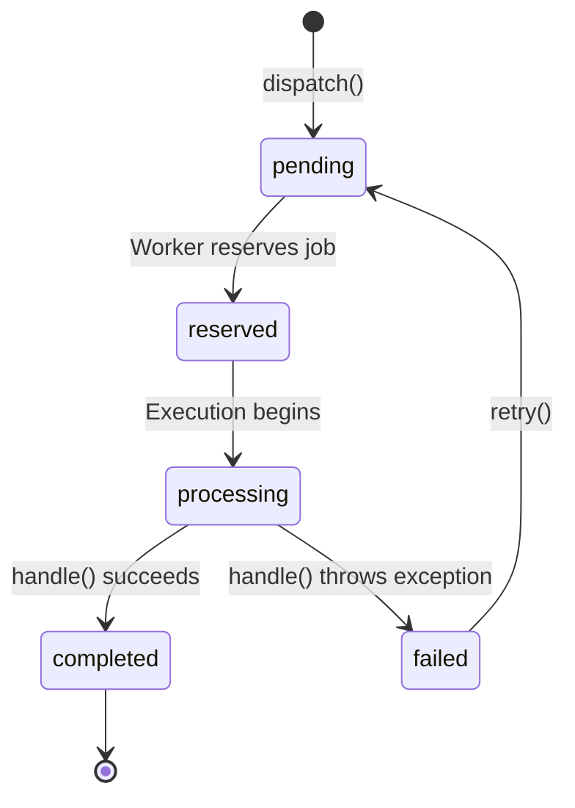

| Status | Meaning |
|---|---|
| `pending` | Job is in the queue, waiting to be picked up |
| `reserved` | A worker has reserved the job but has not yet started executing it |
| `processing` | The job is actively being executed |
| `completed` | Job finished successfully |
| `failed` | Job threw an exception |

### What Station Records per Job

Each job tracked in `station_jobs` stores:

| Field | Type | Description |
|---|---|---|
| `id` | UUID | Station's own ID (UUID7, time-sortable) |
| `queue` | string | Queue name (e.g., `default`, `high`) |
| `connection` | string | Driver connection name |
| `job_class` | string | Fully qualified class name |
| `payload` | longText | Serialized job object |
| `status` | string | `pending`, `reserved`, `processing`, `completed`, `failed` |
| `attempts` | int | How many times the job has been attempted |
| `max_tries` | int | Maximum retry attempts allowed |
| `timeout` | int | Per-attempt timeout in seconds |
| `priority` | int | Queue priority level |
| `batch_id` | UUID | Parent batch ID (if part of a batch) |
| `tags` | JSON | User-defined tags for filtering |
| `worker_id` | string | Which worker is processing this job |
| `memory_used` | int | Peak memory during processing (bytes) |
| `processing_time` | int | How long execution took (milliseconds) |
| `available_at` | timestamp | When the job becomes available (for delayed jobs) |
| `reserved_at` | timestamp | When a worker reserved the job |
| `started_at` | timestamp | When execution began |
| `completed_at` | timestamp | When execution finished |
| `exception` | text | Exception message (populated for failed jobs) |

Failed jobs are also stored in `station_failed_jobs` with the full exception trace and context.

### Station Dispatch vs Laravel Dispatch

| Feature | `dispatch()` | `Station::dispatch()` |
|---|---|---|
| Job tracked in `station_jobs` | Yes (via event listener) | Yes |
| Custom tags | No | Yes |
| Priority control | Via queue name | Explicit priority field |
| Batch ID correlation | Automatic (via Batchable trait) | Automatic |
| Metrics recorded | Yes | Yes |

Both paths end up tracked identically. The difference is that Station's API adds fluent options for tags and priority.

### Tag Configuration

Tags are configured via `station.tags` in config:

| Setting | Default | Description |
|---|---|---|
| `enabled` | `true` | Set to `false` to disable all tagging |
| `max_length` | 100 | Maximum character length per tag (truncated) |
| `max_per_job` | 10 | Maximum number of tags per job (excess dropped) |
| `auto_tags` | `[]` | Tags added automatically to every job. Supported values: `'environment'` (adds `env:production`), `'queue'` (adds `queue:default`), `'connection'` (adds `connection:redis`) |

Jobs implementing `Taggable` (with a `tags(): array` method) have their tags merged with any auto-tags. Tags from `Station::job()->tags([...])` are also merged.

### Station Job Events

In addition to Laravel's native queue events, Station dispatches its own events that you can listen to:

| Event | When Fired | Key Properties |
|---|---|---|
| `JobDispatched` | After a job is dispatched via Station | `Job $job` |
| `JobStarted` | When a worker begins executing a job | `string $jobId`, `string $jobClass`, `string $queue`, `string $connection` |
| `JobCompleted` | When a job finishes successfully | `string $jobId`, `string $jobClass`, `string $queue`, `string $connection`, `float $durationMs` |
| `JobProcessed` | After job processing is recorded | `Job $job`, `string $worker`, `int $duration`, `int $memoryUsed` |
| `JobFailed` | When a job fails | `Job $job`, `Throwable $exception`, `int $attempts`, `bool $willRetry` |
| `JobRetrying` | When a failed job is retried | `Job $job`, `int $attempt`, `?int $delay`, `?Throwable $exception` |
| `JobRecovered` | When a stuck job is recovered | `Job $job`, `string $strategy`, `bool $fromCheckpoint` |

All events are in the `Station\Events` namespace.

---

## Batches

### How Batches Work

Station's batch system wraps Laravel's native `Bus::batch()`. When you create a batch through Station, it:

1. Calls `Bus::batch($jobs)->onQueue($queue)->allowFailures()->dispatch()`
2. Gets back a Laravel batch with an ID from the `job_batches` table
3. Creates a Station overlay record in `station_batches` with the **same ID**
4. Tracks progress via event listeners as individual jobs complete or fail

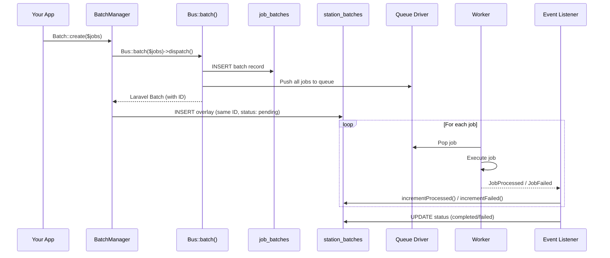

Jobs in a batch **must** use Laravel's `Batchable` trait. This is a Laravel requirement, not a Station one.

```php
use Illuminate\Bus\Batchable;

class ProcessOrderJob implements ShouldQueue
{
    use Batchable, Dispatchable, InteractsWithQueue, Queueable;

    public function handle(): void
    {
        // Check if batch was cancelled
        if ($this->batch()?->cancelled()) {
            return;
        }

        // Do work...
    }
}
```

### The Overlay Table Strategy

Laravel's `job_batches` table is the source of truth for batch dispatching and the `Batchable` trait. Station's `station_batches` is an overlay that adds:

| Field | In `job_batches` | In `station_batches` | Why Station needs it |
|---|---|---|---|
| `id` | Yes | Yes (same value) | Shared identifier |
| `name` | Yes | Yes | - |
| `status` | No (derived) | Yes (explicit) | Explicit status tracking: `pending`, `processing`, `completed`, `failed`, `cancelled` |
| `total_jobs` | Yes | Yes | - |
| `pending_jobs` | Yes | Yes | Atomic counter (see below) |
| `processed_jobs` | No | Yes | Laravel doesn't track this directly |
| `failed_jobs` | Yes | Yes | Atomic counter |
| `allowed_failures` | No (boolean only) | Yes (integer) | Station supports "allow up to N failures" |
| `failed_job_ids` | Yes | Yes | Tracks which specific jobs failed |
| `started_at` | No | Yes | When first job began processing |
| `finished_at` | No | Yes | When batch reached terminal state |
| `cancelled_at` | No | Yes | When batch was cancelled |
| `connection` | No | Yes | Which queue driver connection |

### Atomic Counter Tracking

A critical implementation detail: **Laravel fires `JobProcessed` before updating `job_batches` counters.** This means that in Station's event listener, calling `Bus::findBatch($id)` reads stale data from `job_batches`.

Station solves this with atomic SQL operations directly on `station_batches`:

```php
// incrementProcessed() runs this SQL:
UPDATE station_batches
SET processed_jobs = processed_jobs + 1,
    pending_jobs = GREATEST(pending_jobs - 1, 0)
WHERE id = ?

// incrementFailed() runs this SQL:
UPDATE station_batches
SET failed_jobs = failed_jobs + 1,
    processed_jobs = processed_jobs + 1,
    pending_jobs = GREATEST(pending_jobs - 1, 0)
WHERE id = ?
```

The `syncFromLaravel()` method exists for reconciliation, but real-time tracking uses atomic increments.

### Batch Lifecycle

```mermaid
stateDiagram-v2
    [*] --> pending: Batch::create()
    pending --> processing: First job starts
    processing --> completed: All jobs done, failures ≤ allowed
    processing --> failed: Failures > allowed_failures
    pending --> cancelled: cancel()
    processing --> cancelled: cancel()
    completed --> [*]
    failed --> [*]
    cancelled --> [*]
```

1. **Created**: `BatchManager::create()` dispatches via `Bus::batch()`, creates overlay record with status `pending`
2. **Started**: When the first job begins processing, status moves to `processing`
3. **Progress**: Each `JobProcessed` event increments `processed_jobs` and decrements `pending_jobs`
4. **Failure check**: On each job failure, if `failed_jobs > allowed_failures`, the batch is marked `failed` immediately (and remaining jobs are cancelled via Laravel)
5. **Finished**: When `pending_jobs` reaches 0:
   - If `failed_jobs == 0` → status = `completed`
   - If `failed_jobs > 0` → status = `failed`
6. **Cancelled**: `cancel()` delegates to Laravel's `$laravelBatch->cancel()`. Jobs check `$this->batch()->cancelled()` in their `handle()` method.

### Failure Thresholds

Laravel's `allowFailures()` is boolean. Station extends this with an integer `allowed_failures`:

```php
$batch = Batch::create(
    jobs: $jobs,
    name: 'Import Users',
    allowedFailures: 5,  // Allow up to 5 jobs to fail
);
```

- `allowed_failures = 0`: Any single failure marks the batch as failed immediately
- `allowed_failures = 5`: The batch continues processing even with up to 5 failures. If a 6th failure occurs, the batch is failed immediately and remaining jobs are cancelled
- Station always tells Laravel `allowFailures(true)` (allow all at the Laravel level) and handles the threshold check itself via `hasExceededAllowedFailures()`

### Batch Events

Station dispatches events at key points in the batch lifecycle:

| Event | When Fired | Key Properties |
|---|---|---|
| `BatchCreated` | After a batch is created and dispatched | `Batch $batch`, `int $totalJobs`, `array $options` |
| `BatchProgress` | After a job in the batch completes or fails | `Batch $batch`, `int $processed`, `int $failed`, `float $percentage` |
| `BatchCompleted` | When all jobs finish and the batch succeeds | `Batch $batch`, `int $duration`, `int $jobsProcessed` |
| `BatchFailed` | When the batch exceeds its failure threshold | `Batch $batch`, `array $failedJobs`, `?Throwable $exception` |
| `BatchCancelled` | When a batch is cancelled | `Batch $batch` |

All events are in the `Station\Events` namespace.

---

## Workflows

Station provides two workflow systems that serve different use cases.

### Simple Workflows

A lightweight DAG wrapper around `Bus::batch()`. Define steps with dependencies, Station resolves execution order via topological sort, and dispatches as a single batch.

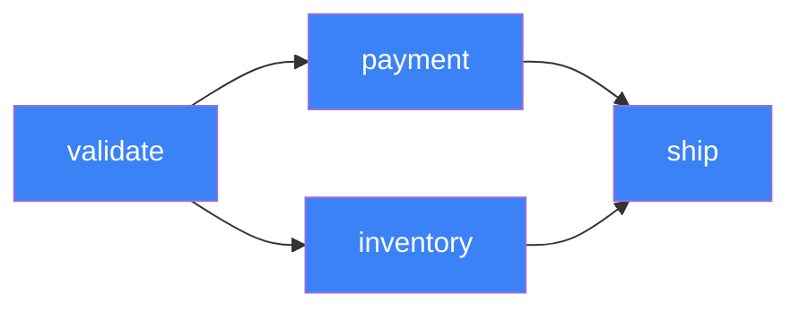

Topological sort produces execution groups — steps in the same group run in parallel:

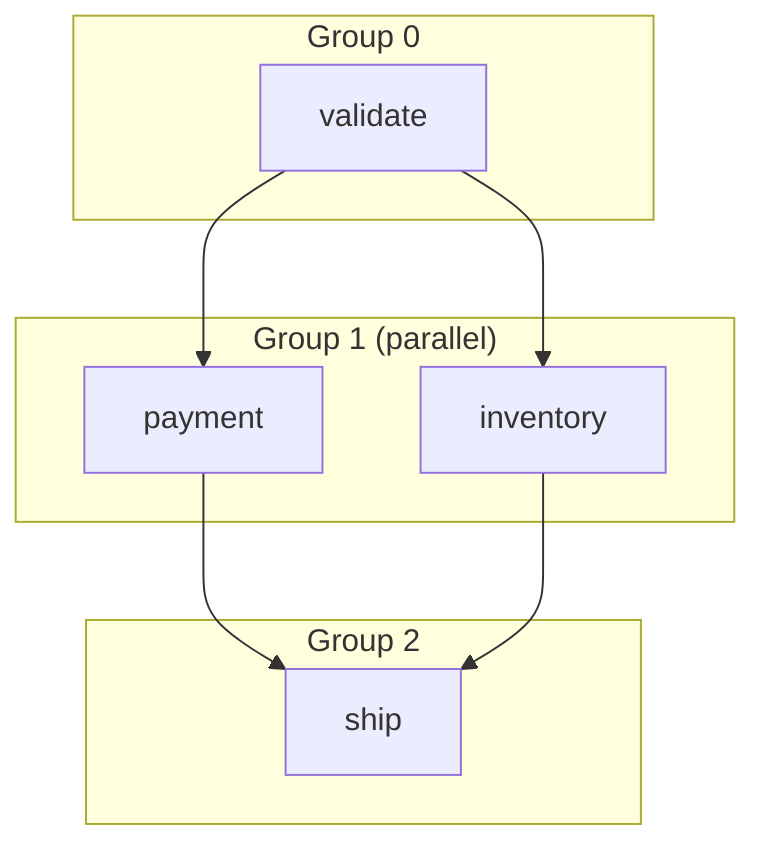

```php
use Station\Core\Workflow;

$workflowId = Workflow::create('order-pipeline')
    ->add('validate', new ValidateOrderJob($order))
    ->add('payment', new ProcessPaymentJob($order), ['validate'])
    ->add('inventory', new ReserveInventoryJob($order), ['validate'])
    ->add('ship', new ShipOrderJob($order), ['payment', 'inventory'])
    ->onQueue('high')
    ->dispatch();
```

**How it works internally:**

1. `resolveExecutionOrder()` uses Kahn's algorithm to produce execution groups:
   - Group 0: `[validate]` (no dependencies)
   - Group 1: `[payment, inventory]` (both depend on validate)
   - Group 2: `[ship]` (depends on payment and inventory)
2. `buildBatch()` converts groups into a nested `Bus::batch()` structure
3. Jobs in the same group run in parallel; groups run sequentially
4. Sets `workflowId`, `workflowName`, `workflowStep` properties on each job

**Limitations:** No persistence, no pause/resume, no conditional logic. Once dispatched, it's a standard Laravel batch.

### Chain Workflows

For strictly sequential job execution, Station provides `Chain::create()` — a wrapper around Laravel's `Bus::chain()`:

```php
use Station\Facades\Chain;

Chain::create([
    new ValidateOrderJob($order),
    new ChargePaymentJob($order),
    new ShipOrderJob($order),
])
->name('order-fulfillment')
->onQueue('high')
->catch(fn(Throwable $e) => Log::error("Chain failed: {$e->getMessage()}"))
->finally(fn() => Log::info('Chain finished'))
->dispatch();
```

Chain sets `chainId`, `chainIndex`, and `chainName` properties on each job (if the property exists). Unlike Simple Workflows, chains are purely sequential — each job runs only after the previous one completes. Unlike the full workflow engine, chains have no persistence, no conditional logic, and no pause/resume.

### Full Workflow Engine

A persistent, stateful workflow system stored in `station_workflows`.

```php
use Station\Facades\Workflow;

// Define a reusable workflow
$definition = Workflow::define('payment-processing')
    ->description('Process payments and send confirmations')
    ->addStep('validate', ValidatePaymentJob::class)
    ->addStep('charge', ChargeCardJob::class, ['validate'])
    ->addConditionalStep('notify',
        SendNotificationJob::class,
        fn($context) => $context['charge_successful'] ?? false,
        ['charge']
    )
    ->timeout(3600)
    ->maxRetries(3)
    ->source('api')                       // Optional: track where the definition came from
    ->withMetadata(['team' => 'billing']); // Optional: attach arbitrary metadata

// Run synchronously
$instance = Workflow::run('payment-processing', [
    'amount' => 99.99,
    'currency' => 'usd',
    'user_id' => 42,
]);

// Or run asynchronously (recommended for production)
$instance = Workflow::runAsync('payment-processing', [
    'amount' => 99.99,
    'currency' => 'usd',
    'user_id' => 42,
]);
```

**Instance lifecycle:**

```mermaid
stateDiagram-v2
    [*] --> pending: Workflow::run()
    pending --> running: Execution starts
    running --> completed: All steps done
    running --> failed: Step fails (max retries exceeded)
    running --> paused: pause()
    paused --> running: resume()
    pending --> cancelled: cancel()
    running --> cancelled: cancel()
    paused --> cancelled: cancel()
    completed --> [*]
    failed --> [*]
    cancelled --> [*]
```

Each instance tracks:
- `status` — current state
- `current_step` — which step is executing
- `step_statuses` — per-step status map (`pending`, `queued`, `running`, `completed`, `failed`, `skipped`)
- `context` — shared mutable state passed between steps
- `results` — output from each completed step
- `input` — original input data
- `connection` — queue connection for async dispatch (null for sync)
- `definition_steps` — snapshot of the step graph at execution time
- `progress` — percentage derived from completed/skipped steps

### Workflow Execution Model

Station supports two execution modes: `Workflow::run()` (synchronous) and `Workflow::runAsync()` (asynchronous). Async mode is recommended for production because each step runs as a queued job, enabling true parallel execution across workers.

Steps are instantiated with `(string $instanceId, array $context, array $results)` as constructor arguments. `$results` contains the return values from all previously completed steps, keyed by step name. After each step, context updates are merged if the job implements `getContextUpdates()`.

#### Synchronous Execution

`Workflow::run()` executes all steps in the calling process. Topological sort groups independent steps; groups run sequentially, and steps within a group also run sequentially.

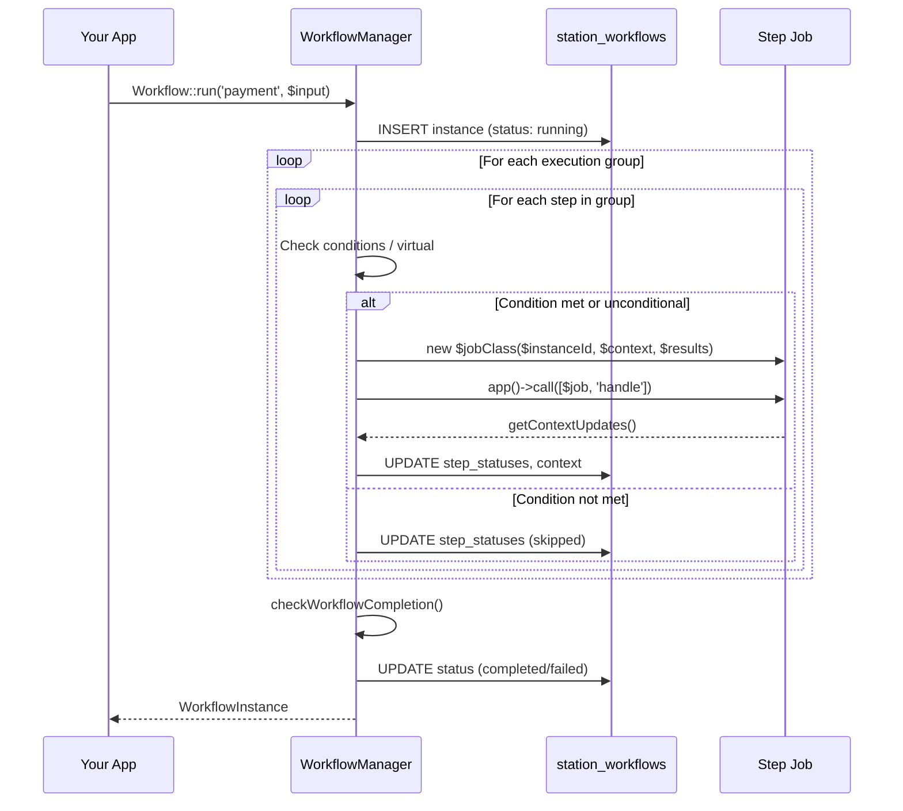

Both sync and async paths use `areDependenciesResolved()` (completed or skipped) and `checkWorkflowCompletion()` (deadlock detection) for step evaluation.

#### Asynchronous Execution

`Workflow::runAsync()` persists the instance and dispatches a `RunWorkflowJob`. From there, all step execution is queued:

1. `runAsync()` → creates and persists instance → dispatches `RunWorkflowJob`
2. `RunWorkflowJob::handle()` → calls `executeExistingInstance()` → starts workflow → `advanceWorkflowAsync()`
3. `advanceWorkflowAsync()` — the core orchestration loop:
   - Evaluates which pending steps have resolved dependencies
   - Auto-completes virtual steps inline (fan-in completion markers)
   - Skips conditional steps whose condition is false
   - Marks real steps as `queued` and dispatches a `WorkflowStepJob` per step
4. `WorkflowStepJob::handle()` → calls `executeAsyncStep()` — three-phase pattern:
   - **Phase 1 (Claim):** `lockForUpdate()`, verify step is `queued`, transition to `running`
   - **Phase 2 (Execute):** outside the lock, `app()->call([$job, 'handle'])`
   - **Phase 3 (Record + Advance):** `lockForUpdate()`, record result, call `advanceWorkflowAsync()` to dispatch newly unblocked steps
5. If `RunWorkflowJob` itself fails (e.g., definition not found), `RunWorkflowJob::failed()` calls `handleAsyncStepFailure()` with the pseudo-step name `_starter`, which fails the entire workflow

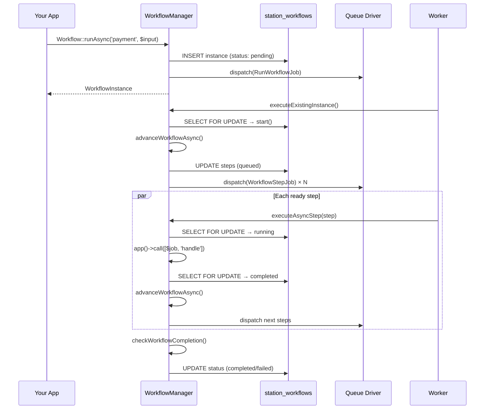

#### Step Status Lifecycle

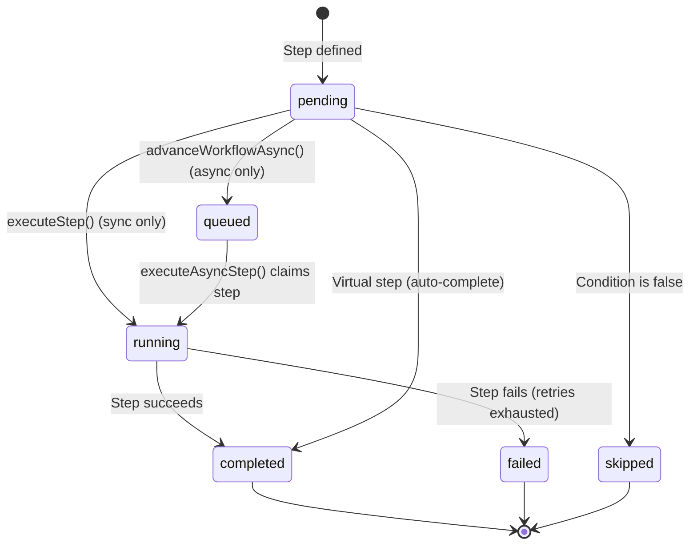

The `queued` status only exists in async mode. In sync mode, steps transition directly from `pending` to `running`.

### Row-Level Locking

All async state transitions use `loadInstanceForUpdate()` (`SELECT ... FOR UPDATE`). This prevents race conditions when multiple workers complete steps concurrently and try to advance the workflow simultaneously. Each critical section (claim, record, advance) runs inside a database transaction with the row lock held.

### Virtual Steps

`addParallel()` creates a virtual completion step that depends on all parallel steps. When all parallel steps finish, the virtual step auto-completes, enabling downstream steps to proceed. This is the fan-in pattern for DAG convergence.

```php
Workflow::define('order-processing')
    ->addStep('validate', ValidateOrderJob::class)
    ->addParallel('fulfillment', [
        'payment' => ProcessPaymentJob::class,
        'inventory' => ReserveInventoryJob::class,
        'notification' => SendConfirmationJob::class,
    ], ['validate'])  // All 3 depend on 'validate'
    ->addStep('ship', ShipOrderJob::class, ['fulfillment']);  // Depends on virtual step
```

This creates steps `payment`, `inventory`, `notification` (all depending on `validate`), plus a virtual step `fulfillment` that depends on all three. The `ship` step waits for the virtual `fulfillment` step, which auto-completes when all parallel steps finish.

### Definition Step Snapshotting

When a workflow starts (sync or async), the current definition steps are serialized into the `definition_steps` column on `station_workflows`. Running instances use this snapshot of the step graph, ensuring they are unaffected if the definition is modified after execution begins.

### Deadlock Detection

`checkWorkflowCompletion()` evaluates three possible states:

1. **All steps done** (completed, skipped, or failed) → workflow completes or fails depending on whether any step failed
2. **No progress possible** — remaining pending steps have only failed dependencies → workflow fails with "deadlocked"
3. **Active steps exist** (queued or running) → workflow continues

### Stuck Workflow Recovery

`recoverStuckWorkflows(threshold)` finds running workflows that haven't been updated within the threshold (default 300s) and takes corrective action:

- **Re-dispatches** queued steps that were lost (worker died before picking up the job)
- **Fails** running steps that timed out (worker died mid-execution)
- **Advances** stalled workflows where no steps are queued/running but the workflow isn't complete

Triggered via `php artisan station:recover --workflows`.

### Conditional Steps and Branching

**Conditional steps** only execute if a condition evaluates to true:

```php
->addConditionalStep('send_email',
    SendEmailJob::class,
    fn($context) => $context['email_opted_in'] ?? false,
    ['previous_step']
)
```

If the condition is false, the step is marked as `skipped` and doesn't block downstream steps.

**Branch steps** dynamically select which job to run based on context:

```php
->addBranch('route_payment',
    fn($context) => $context['gateway'],  // returns 'stripe' or 'paypal'
    [
        'stripe' => ProcessStripeJob::class,
        'paypal' => ProcessPayPalJob::class,
    ],
    ['validate']
)
```

### Context Propagation

The context is a shared `array` that accumulates across steps:

1. Workflow starts with `context = input` (the data passed to `Workflow::run()`)
2. Each step receives the current context in its constructor
3. After each step, `getContextUpdates()` is called if the method exists
4. The returned array is merged into context for subsequent steps

In addition to context, steps receive `$results` — an array of return values from all completed steps keyed by step name (e.g., `$results['validate']`). This is separate from context: results are read-only outputs from each step's `handle()` return value, while context is the shared mutable state.

This allows steps to communicate without tight coupling.

### Per-Step Configuration

Each `WorkflowStep` supports individual retry and timeout configuration:

| Config | Default | Description |
|---|---|---|
| `timeout` | `null` (no limit) | Per-step timeout in seconds |
| `retries` | 3 | Maximum retry attempts for the step |
| `retryDelay` | 60 | Delay in seconds between retries |

In async mode, these are applied to the `WorkflowStepJob` dispatched for each step. In sync mode, retries are not applied (the step runs once).

### Workflow Events

Station dispatches events at key points in the workflow lifecycle:

| Event | When Fired | Key Properties |
|---|---|---|
| `WorkflowStarted` | When a workflow instance begins execution | `WorkflowInstance $instance` |
| `WorkflowStepCompleted` | After a step finishes successfully | `WorkflowInstance $instance`, `string $stepName`, `mixed $result` |
| `WorkflowCompleted` | When all steps finish and the workflow succeeds | `WorkflowInstance $instance` |
| `WorkflowFailed` | When a step fails (retries exhausted) or the workflow deadlocks | `WorkflowInstance $instance` |

All events are in the `Station\Events` namespace.

Station's `StationServiceProvider` also records metrics for workflow steps via event listeners, using a synthetic queue name `workflow:{definition_name}`. This means workflow step performance appears in the metrics system alongside regular queue metrics.

---

## Workers and Supervisor

### Supervisor Architecture

`station:work` starts a `WorkerSupervisor` that manages child worker processes:

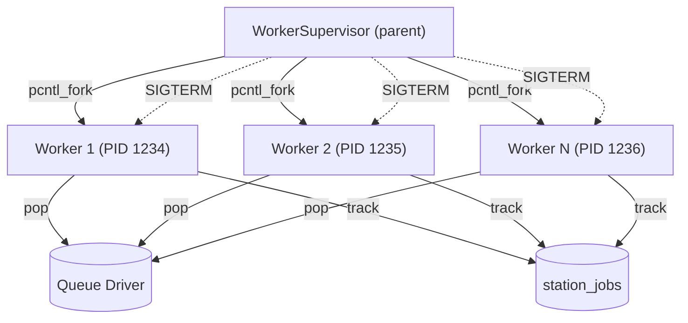

```
WorkerSupervisor (parent process)
├── Worker 1 (forked child, PID 1234)
├── Worker 2 (forked child, PID 1235)
└── Worker 3 (forked child, PID 1236)
```

The supervisor:
1. Forks N child processes (configurable via `--workers` or `config[supervisors][default][processes]`)
2. Runs a loop every 100ms that:
   - Reaps dead workers (`pcntl_waitpid` with `WNOHANG`)
   - Restarts workers to maintain the desired pool size
   - Collects metrics
3. On shutdown (`SIGTERM`/`SIGINT`), sends `SIGTERM` to all workers, waits up to a configurable timeout, then `SIGKILL`s any remaining

### Worker Process

Each forked child runs `Worker::run()`, which:

1. Reconnects the database (required after `pcntl_fork()`)
2. Creates fresh instances of `Worker`, `JobRepository`, `MetricsCollector` from the container
3. Enters a loop:
   - Pops a job from the queue via the configured driver
   - Dispatches `JobProcessing` event (triggers Station's tracking)
   - Calls `$job->fire()` (Laravel's job execution)
   - Dispatches `JobProcessed` or `JobFailed` event
   - Tracks completion/failure in `station_jobs`
   - Records metrics
   - Sleeps if no job available

The worker fires Laravel's standard queue events (`JobProcessing`, `JobProcessed`, `JobFailed`). This is critical because the `StationServiceProvider` event listeners depend on these events to update batch progress, record metrics, and track job state.

### Signal Handling

Both supervisor and workers use `pcntl_async_signals(true)`:

| Signal | Supervisor | Worker |
|---|---|---|
| `SIGTERM` | Graceful shutdown | Stop after current job |
| `SIGINT` | Graceful shutdown | Stop after current job |
| `SIGQUIT` | Graceful shutdown | - |
| `SIGUSR1` | Pause (forwards to workers) | Pause processing |
| `SIGUSR2` | Resume (forwards to workers) | Resume processing |
| `SIGALRM` | - | Job timeout (throws `RuntimeException`) |

### Memory and Time Limits

Workers enforce several limits:

| Limit | Config Key | Default | Behavior |
|---|---|---|---|
| Memory | `supervisors.default.memory` | 128 MB | Worker exits, supervisor restarts it |
| Max jobs | `supervisors.default.max_jobs` | 0 (unlimited) | Worker exits after N jobs |
| Max time | `supervisors.default.max_time` | 0 (unlimited) | Worker exits after N seconds |
| Job timeout | `supervisors.default.timeout` | 60 seconds | `pcntl_alarm()` kills the job |
| Sleep | `supervisors.default.sleep` | 3 seconds | Delay between polls when queue is empty |

---

## Recovery System

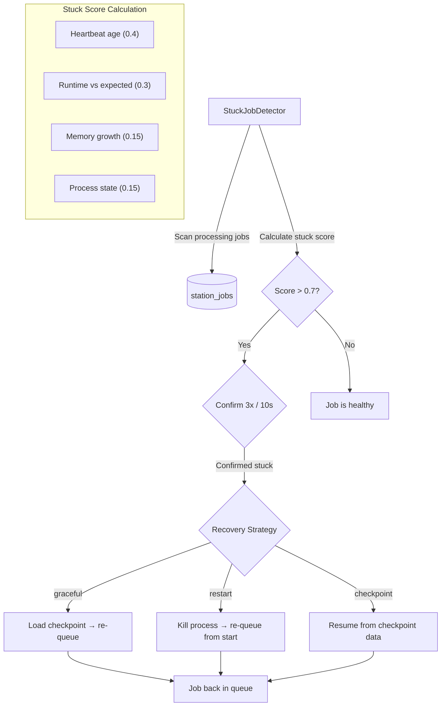

### Job Checkpointing

Jobs can implement `Checkpointable` to save progress that survives failures:

```php
use Station\Contracts\Checkpointable;

class ImportUsersJob implements ShouldQueue, Checkpointable
{
    private int $lastId = 0;
    private int $processed = 0;

    public function handle(): void
    {
        User::where('id', '>', $this->lastId)->chunk(100, function ($users) {
            foreach ($users as $user) {
                $this->processUser($user);
                $this->processed++;
            }
            $this->lastId = $users->last()->id;
        });
    }

    // Called periodically to save progress
    public function checkpoint(): array
    {
        return ['last_id' => $this->lastId, 'processed' => $this->processed];
    }

    // Called before handle() when resuming from a checkpoint
    public function restore(array $data): void
    {
        $this->lastId = $data['last_id'] ?? 0;
        $this->processed = $data['processed'] ?? 0;
    }

    // Return false when all work is done
    public function hasMoreWork(): bool
    {
        return User::where('id', '>', $this->lastId)->exists();
    }
}
```

Checkpoints are stored in `station_checkpoints` (one row per job, keyed by job ID). Optional encryption via `STATION_CHECKPOINT_ENCRYPT=true`.

### Stuck Job Detection

`StuckJobDetector` identifies jobs that are likely hung:

1. Finds jobs in `processing` status longer than the configured timeout
2. Calculates a "stuck score" (0.0 to 1.0) based on weighted factors:
   - Heartbeat age: weight 0.4
   - Runtime vs expected: weight 0.3
   - Memory growth: weight 0.15
   - Process state: weight 0.15
3. Jobs scoring above 0.7 are considered stuck

### Recovery Strategies

| Strategy | Behavior |
|---|---|
| `graceful` | Load checkpoint, re-queue job to resume from last saved position |
| `restart` | Kill the worker process, re-queue job from the beginning |
| `checkpoint` | Specifically use checkpoint data to resume |

```bash
# Scan and recover stuck jobs
php artisan station:recover

# Dry run to see what would be recovered
php artisan station:recover --dry-run

# Use specific strategy (graceful, restart, checkpoint)
php artisan station:recover --strategy=graceful

# Custom stuck threshold (seconds)
php artisan station:recover --threshold=600

# Also recover stuck workflow steps
php artisan station:recover --workflows

# Only recover jobs on a specific queue
php artisan station:recover --queue=high
```

### Health Checks

`HealthChecker` evaluates the overall system:

| Check | What It Verifies |
|---|---|
| Database | Station database connection is accessible (latency measured) |
| Connections | Can reach each configured queue driver (deep check via `->size()`, latency measured) |
| Disk | Storage disk usage below warning/critical thresholds |

Returns an overall `HealthStatus` enum:

| Status | Value | Meaning |
|---|---|---|
| Healthy | `healthy` | All checks pass |
| Warning | `warning` | Disk usage above warning threshold but below critical |
| Degraded | `degraded` | Non-critical checks have warnings |
| Unhealthy | `unhealthy` | Database or connections unreachable, or disk above critical threshold |

**Two connectivity check modes:**
- `checkConnections()` — Deep check: actually calls `->size()` on each queue driver. Used by `station:health` and the health API endpoint.
- `checkConnectivityQuick()` — Lightweight TCP probe with 2-second timeout. Sends protocol-specific commands (PING for Redis, AMQP header for RabbitMQ, stats for Beanstalkd, ApiVersions for Kafka). SQS is skipped (cloud service). Used for dashboard polling.

---

## Metrics and Monitoring

### What Station Measures

Station records metrics at two levels: per-job and aggregate.

### Per-Job Metrics

Stored on each `station_jobs` record:

| Metric | Field | Unit |
|---|---|---|
| Processing time | `processing_time` | Milliseconds |
| Memory usage | `memory_used` | Bytes |
| Attempts | `attempts` | Count |
| Wait time | Derived from `created_at` to `started_at` | Milliseconds |

### Aggregate Metrics

Stored in `station_metrics` at configurable intervals:

| Metric | Description |
|---|---|
| `jobs_processed` | Total jobs completed in this interval |
| `jobs_failed` | Total jobs failed in this interval |
| `jobs_pending` | Queue depth at time of recording |
| `avg_processing_time` | Mean execution time (ms) |
| `avg_wait_time` | Mean time in queue before processing (ms) |
| `peak_memory` | Highest memory usage seen (bytes) |
| `active_workers` | Number of workers running |

### Derived Metrics

The `MetricsCollector` computes:

| Metric | Method | Description |
|---|---|---|
| Throughput | `getThroughput(?queue)` | Jobs per minute |
| Failure rate | `getFailureRate(?queue)` | `failed / (processed + failed)` as percentage |
| Average wait time | `getAverageWaitTime(?queue)` | Mean queue wait (ms) |
| Average processing time | `getAverageProcessingTime(?queue)` | Mean execution time (ms) |

### Prometheus Export

Available at `GET /api/station/metrics/prometheus`:

```
station_jobs_total{queue="default",status="completed"} 15234
station_jobs_total{queue="default",status="failed"} 42
station_queue_size{queue="default"} 150
station_workers_active 8
```

---

## Dashboard

### Pages

| Page | Route | Content |
|---|---|---|
| Dashboard | `GET /station` | Overview stats, recent jobs, health indicators |
| Connections | `GET /station/connections` | Queue list with depths, pause/resume controls |
| Jobs | `GET /station/jobs` | Paginated job list with filters (status, queue, class) |
| Job Detail | `GET /station/jobs/{id}` | Full job payload, timeline, attempts, exception |
| Pending | `GET /station/pending` | Pending jobs awaiting processing |
| Failed | `GET /station/failed` | Failed jobs with retry/delete actions |
| Stuck | `GET /station/stuck` | Stuck jobs with recovery actions |
| Completed | `GET /station/completed` | Recently completed jobs |
| Silenced | `GET /station/silenced` | Jobs from silenced job classes |
| Batches | `GET /station/batches` | Batch list with progress bars, status filters |
| Batch Detail | `GET /station/batches/{id}` | Batch jobs, counters, failed job IDs |
| Workflows | `GET /station/workflows` | Running workflow instances |
| Workflow Definitions | `GET /station/workflows/definitions` | Reusable workflow definitions |
| Workflow Detail | `GET /station/workflows/{id}` | Step-by-step progress, context, results |
| Metrics | `GET /station/metrics` | Aggregate metrics with time range selection |
| Metric Records | `GET /station/metrics/records` | Raw metric data records |
| Settings | `GET /station/settings` | Configuration viewer |

### API Endpoints

All paths below are relative to the API prefix (default: `/api/station`, configurable via `station.api.prefix`). Authenticated via Bearer token. See [Security - API Authentication](security.md#api-authentication) for auth details.

> **Note:** The dashboard uses a separate set of session-authenticated web routes under `/station/api/` (configurable via `station.dashboard.path`). The routes below are the external API for programmatic access.

**Jobs:**
- `GET /stats` — Overview statistics
- `GET /jobs` — List jobs (filterable by status, queue, class, tags)
- `GET /jobs/{id}` — Job details
- `POST /jobs/{id}/retry` — Retry a job
- `POST /jobs/{id}/cancel` — Cancel a job
- `POST /jobs/bulk/cancel` — Bulk cancel jobs
- `POST /jobs/bulk/retry` — Bulk retry jobs
- `POST /jobs/bulk/delete` — Bulk delete jobs

**Failed Jobs:**
- `GET /failed` — List failed jobs
- `POST /failed/{id}/retry` — Retry specific failed job
- `DELETE /failed/{id}` — Delete specific failed job
- `POST /failed/retry-all` — Retry all failed jobs
- `DELETE /failed` — Flush all failed jobs
- `POST /failed/bulk/retry` — Bulk retry failed jobs
- `POST /failed/bulk/delete` — Bulk delete failed jobs

**Batches:**
- `GET /batches` — List batches
- `GET /batches/{id}` — Batch details
- `POST /batches/{id}/cancel` — Cancel batch
- `POST /batches/{id}/retry` — Retry failed batch jobs
- `POST /batches/bulk/cancel` — Bulk cancel batches
- `POST /batches/bulk/retry` — Bulk retry batches
- `POST /batches/bulk/delete` — Bulk delete batches

**Workflows:**
- `POST /workflows/run` — Run a workflow definition
- `GET /workflows/{name}/{id}/status` — Workflow instance status
- `POST /workflows/{id}/pause` — Pause workflow
- `POST /workflows/{id}/resume` — Resume workflow
- `POST /workflows/{id}/cancel` — Cancel workflow
- `POST /workflows/bulk/pause` — Bulk pause workflows
- `POST /workflows/bulk/resume` — Bulk resume workflows
- `POST /workflows/bulk/cancel` — Bulk cancel workflows

**Workers & Supervisor:**
- `GET /workers/dashboard-status` — Worker status for dashboard
- `GET /workers/status` — Detailed worker status
- `POST /workers/start` — Start a worker
- `POST /workers/stop` — Stop a worker
- `POST /workers/stop-external` — Stop an external worker
- `GET /supervisor/status` — Supervisor status
- `POST /supervisor/start` — Start supervisor
- `POST /supervisor/stop` — Stop supervisor

**Queue Management:**
- `GET /queues/connections` — List queue connections
- `POST /queues/pause` — Pause a queue
- `POST /queues/resume` — Resume a queue
- `GET /queues/pause-status` — Get queue pause status

**Monitoring & Metrics:**
- `GET /health` — Health check
- `GET /metrics` — Metrics summary
- `GET /metrics/time-series` — Time-series metrics data
- `GET /metrics/driver-info` — Per-driver metric info
- `GET /monitoring` — Monitoring overview
- `GET /drivers` — Driver connectivity and info

**Tags:**
- `GET /tags` — List all tags
- `POST /jobs/{id}/tags` — Add tag to a job
- `DELETE /jobs/{id}/tags/{tag}` — Remove tag from a job

**Stuck Jobs & Recovery:**
- `GET /stuck` — List stuck jobs
- `POST /stuck/{id}/recover` — Recover a specific stuck job
- `POST /stuck/bulk/recover` — Bulk recover stuck jobs
- `POST /recover` — Trigger stuck job recovery

### Real-Time Refresh

All dashboard pages auto-refresh via Inertia.js partial reloads every 3 seconds. Only the data props are reloaded, not the full page, keeping the experience smooth.

---

## Database Schema

Station creates these tables (all prefixed with `station_`):

| Table | Purpose |
|---|---|
| `station_jobs` | Every dispatched job, with status and metrics |
| `station_failed_jobs` | Failed jobs with exception and context |
| `station_job_events` | Event timeline per job (queued, processing, completed, failed) |
| `station_batches` | Batch metadata overlay on Laravel's `job_batches` |
| `station_checkpoints` | Checkpoint data for resumable jobs |
| `station_metrics` | Aggregated metrics snapshots per queue |
| `station_supervisors` | Active supervisor processes with heartbeats |
| `station_workers` | Active worker processes |
| `station_audit_log` | Admin actions (retry, delete, pause, etc.) |
| `station_queue_status` | Queue pause/resume state |
| `station_workflows` | Workflow instance state, progress, connection, and definition step snapshots |
| `station_kafka_delayed_jobs` | Kafka-specific delayed job storage |
| `station_driver_snapshots` | Per-driver metric snapshots for connectivity and performance |

Key indexes are on `(queue, status)`, `(status, created_at)`, `(batch_id)`, and `(worker_id)` for efficient dashboard queries.

#### `station_workflows` Columns

| Column | Type | Description |
|---|---|---|
| `id` | UUID | Workflow instance ID |
| `definition_id` | UUID | ID of the workflow definition |
| `definition_name` | string | Name of the workflow definition |
| `connection` | string | Queue connection for async dispatch (null for sync) |
| `status` | string | `pending`, `running`, `paused`, `completed`, `failed`, `cancelled` |
| `current_step` | string | Name of the currently executing step |
| `input` | JSON | Original input data passed to `run()` or `runAsync()` |
| `context` | JSON | Shared mutable context that accumulates across steps |
| `results` | JSON | Return values from completed steps, keyed by step name |
| `step_statuses` | JSON | Per-step status map (`pending`, `queued`, `running`, `completed`, `failed`, `skipped`) |
| `definition_steps` | JSON | Snapshot of the step graph at execution time |
| `error` | text | Error message (if workflow failed) |
| `progress` | int | Completion percentage derived from completed/skipped steps |
| `started_at` | timestamp | When execution began |
| `completed_at` | timestamp | When execution finished |
| `created_at` | timestamp | When the instance was created |
| `updated_at` | timestamp | Last state change |

---

## Job Middleware

Station provides four middleware classes that can be attached to jobs via the `middleware()` method:

### RateLimited

Limits how frequently a job class can be processed. Uses Laravel's `RateLimiter` under the hood:

```php
use Station\Middleware\RateLimited;

class MyJob implements ShouldQueue
{
    public function middleware(): array
    {
        return [new RateLimited(
            key: 'my-job',
            maxAttempts: 10,     // Max executions...
            decaySeconds: 60,    // ...per this window
            releaseOnLimit: true, // Release back to queue when limited
            releaseDelay: 60,    // Seconds before retry
        )];
    }

    // Optional: customize the rate limiter key per-job instance
    public function rateLimiterKey(): string
    {
        return $this->userId;
    }
}
```

### Timeout

Sets an execution time limit using `pcntl_alarm`. Throws `JobTimeoutException` when exceeded:

```php
use Station\Middleware\Timeout;

public function middleware(): array
{
    return [new Timeout(
        seconds: 30,
        releaseOnTimeout: false, // If true, release back to queue instead of failing
        releaseDelay: 0,
    )];
}
```

Requires `ext-pcntl`. Without it, the middleware is a no-op.

### Unique

Ensures only one instance of a job exists in the queue at a time, using cache-based locks:

```php
use Station\Middleware\Unique;

class MyJob implements ShouldQueue
{
    public function middleware(): array
    {
        return [new Unique(lockFor: 3600)]; // Lock for 1 hour
    }

    public function uniqueId(): string
    {
        return $this->userId; // Required: defines uniqueness
    }
}
```

The lock is held for `lockFor` seconds. If another job with the same `uniqueId()` is already locked, this job is skipped.

### WithoutOverlapping

Prevents concurrent execution of jobs that share a key. Unlike `Unique` (which prevents duplicate queueing), this prevents simultaneous processing:

```php
use Station\Middleware\WithoutOverlapping;

public function middleware(): array
{
    return [new WithoutOverlapping(
        key: 'process-order-' . $this->orderId,
        expiresAfter: 300,       // Lock expires after 5 minutes (safety net)
        releaseOnOverlap: true,  // Release back to queue if another instance is running
        releaseDelay: 5,         // Seconds before retry
    )];
}
```

The lock is released when the job finishes. `expiresAfter` is a safety net for crashed workers.

---

## Testing

Station provides a `WithStation` trait and `StationFake` for testing job dispatch without hitting real queues.

### Setup

```php
use Station\Testing\WithStation;

class MyJobTest extends TestCase
{
    use WithStation;

    public function testJobIsDispatched(): void
    {
        $this->fakeStation();

        MyJob::dispatch($data);

        $this->assertStationDispatched(MyJob::class);
    }
}
```

`fakeStation()` also calls `Queue::fake()` and `Bus::fake()` internally.

### Available Assertions

| Method | Description |
|---|---|
| `assertStationDispatched(string $job, ?callable $callback)` | Assert a job class was dispatched, optionally filtering with a callback |
| `assertStationNotDispatched(string $job, ?callable $callback)` | Assert a job was not dispatched |
| `assertNothingDispatched()` | Assert no jobs were dispatched at all |
| `assertStationDispatchedTimes(string $job, int $times)` | Assert exact dispatch count |
| `assertBatchDispatched(?callable $callback)` | Assert a batch was dispatched |
| `assertChainDispatched(array $expectedChain)` | Assert a chain with specific job classes |

### Helper Methods

| Method | Description |
|---|---|
| `getDispatchedJobs(?string $type)` | Get all dispatched job objects, optionally filtered by class |
| `processStationJobs()` | Process all pending jobs synchronously (calls `handle()`) |

---

## Telemetry

Station includes an OpenTelemetry-compatible telemetry system for distributed tracing and metrics.

### Configuration

```php
'telemetry' => [
    'enabled' => env('STATION_TELEMETRY_ENABLED', false),
    'driver' => env('STATION_TELEMETRY_DRIVER', 'internal'),  // 'internal' or 'opentelemetry'
    'service_name' => env('STATION_TELEMETRY_SERVICE', 'station'),
    'endpoint' => env('STATION_TELEMETRY_ENDPOINT'),
],
```

When `ext-opentelemetry` is installed, Station uses `OpenTelemetryTracer` and `OpenTelemetryMeter`. Otherwise it falls back to `InternalTracer` and `InternalMeter`.

### Automatic Instrumentation

When enabled, Station automatically creates spans and records metrics for:

- **Job spans** — Started on `JobStarted`, ended on `JobCompleted`/`JobFailed` with status and exception attributes
- **Workflow spans** — Started on `WorkflowStarted`, ended on `WorkflowCompleted`/`WorkflowFailed`

Metrics counters automatically incremented:
- `station.jobs.started` (labels: queue, job_class)
- `station.jobs.completed` (labels: queue, job_class)
- `station.jobs.failed` (labels: queue, job_class)
- `station.workflows.started` (labels: workflow)
- `station.workflows.completed` (labels: workflow)
- `station.workflows.failed` (labels: workflow)

### Manual Instrumentation

```php
$telemetry = app(TelemetryManager::class);

// Custom span
$span = $telemetry->startSpan('my-operation', ['key' => 'value']);
// ... do work ...
$span->end();

// Record metrics
$telemetry->incrementCounter('my.counter', ['label' => 'value']);
$telemetry->recordHistogram('my.duration', $durationMs, ['queue' => 'default']);
$telemetry->recordMetric('my.gauge', $currentValue);
```

### Memory Safety

Active spans are pruned periodically (every 100 job starts). Ended spans older than 10 minutes and in-flight spans older than 1 hour are removed. A hard cap of 1,000 active spans prevents unbounded growth.

---

## Auto-Scaling

Station supports automatic worker scaling based on queue metrics.

### Scaling Strategies

| Strategy | Enum Value | Description |
|---|---|---|
| Queue Size | `queue_size` | Scale based on pending job count |
| Wait Time | `wait_time` | Scale based on average job wait time |
| CPU Usage | `cpu` | Scale based on worker CPU utilization |
| Memory Usage | `memory` | Scale based on worker memory utilization |
| Custom | `custom` | User-defined scaling logic |

### Scaling Policy Builder

```php
use Station\Scaling\ScalingPolicyBuilder;

$policy = (new ScalingPolicyBuilder('my-policy'))
    ->strategy('queue_size')
    ->workers(min: 1, max: 10)
    ->cooldown(60) // Seconds between scaling actions
    ->scaleUpWhenQueueExceeds(1000, increment: 2)
    ->scaleDownWhenQueueBelow(100, decrement: 1)
    ->scaleUpWhenWaitTimeExceeds(30.0, increment: 1)
    ->scaleDownWhenWaitTimeBelow(5.0, decrement: 1)
    ->build();
```

### Schedule-Based Scaling

```php
$policy = (new ScalingPolicyBuilder('time-based'))
    ->peakHours([9, 10, 11, 12, 13, 14, 15, 16, 17], workers: 8)
    ->offPeakHours([0, 1, 2, 3, 4, 5, 6, 22, 23], workers: 2)
    ->weekdays(workers: 6)
    ->weekends(workers: 2)
    ->build();
```

### Configuration

```php
'scaling' => [
    'enabled' => env('STATION_SCALING_ENABLED', false),
    'strategy' => env('STATION_SCALING_STRATEGY', 'queue_size'),
    'min_workers' => (int) env('STATION_SCALING_MIN', 1),
    'max_workers' => (int) env('STATION_SCALING_MAX', 10),
    'cooldown' => 60,
    'thresholds' => [
        'scale_up' => ['queue_size' => 1000, 'wait_time' => 30],
        'scale_down' => ['queue_size' => 100, 'wait_time' => 5],
    ],
],
```

---

## Worker and Supervisor Events

Station fires events for worker and supervisor lifecycle changes, plus scaling actions.

| Event | Properties | When |
|---|---|---|
| `WorkerStarted` | `worker`, `queues`, `options` | Worker process begins |
| `WorkerStopped` | `worker`, `reason`, `jobsProcessed` | Worker process ends |
| `WorkerLoopIteration` | `workerId` | Each worker loop tick |
| `SupervisorStarted` | `supervisorId`, `name`, `queues`, `options` | Supervisor starts |
| `SupervisorStopped` | `supervisorId`, `name`, `reason`, `jobsProcessed` | Supervisor stops |
| `WorkersScaledUp` | `queue`, `previousCount`, `newCount` | Auto-scaler adds workers |
| `WorkersScaledDown` | `queue`, `previousCount`, `newCount` | Auto-scaler removes workers |

`WorkersScaledUp` provides `getAddedCount()` and `WorkersScaledDown` provides `getRemovedCount()` convenience methods.

---

## Station vs Horizon

### Feature Comparison

| Feature | Horizon | Station |
|---|---|---|
| **Queue Drivers** | Redis only | RabbitMQ, Redis, SQS, Beanstalkd, Kafka |
| **Message Durability** | In-memory (Redis) | Disk-persisted (RabbitMQ) |
| **Dead Letter Queues** | No | Yes (automatic, per-queue) |
| **Job Checkpointing** | No | Yes (resume from saved progress) |
| **Stuck Job Detection** | Basic (timeout only) | Advanced (weighted scoring: heartbeat, runtime, memory, process state) |
| **Stuck Job Recovery** | Manual retry only | Automatic recovery with strategies (graceful, restart, checkpoint) |
| **Batch Progress** | Basic (via `job_batches`) | Enhanced (explicit status, atomic counters, integer failure thresholds) |
| **Failure Thresholds** | Boolean (`allowFailures()`) | Integer (`allowFailures(5)` — allow up to N) |
| **Workflows** | No | Yes (DAG with conditions, branching, pause/resume) |
| **Process Supervision** | Yes | Yes (with `pcntl_fork` and automatic pool maintenance) |
| **Dashboard** | React SPA | Inertia.js + Vue 3 SPA |
| **Per-Job Metrics** | Limited (tags, runtime) | Detailed (processing time, memory, wait time, attempts) |
| **Aggregate Metrics** | Throughput, wait times | Throughput, wait times, failure rate, memory, worker count |
| **Prometheus Export** | No (third-party) | Built-in (`/metrics/prometheus`) |
| **Health Checks** | No | Yes (connections, database, disk, workers) |
| **Alerting** | No (third-party) | Built-in (Slack, Discord, Teams, webhooks, log) |
| **Job Encryption** | No | Yes (`ShouldBeEncrypted` interface) |
| **Payload Masking** | No | Yes (`ShouldMaskPayload` for dashboard) |
| **Audit Logging** | No | Yes (tracks retry, delete, pause actions) |
| **API** | Limited internal API | Full REST API with Bearer auth |
| **RBAC** | Gate-based authorization | Gate-based authorization |

### What Station Can Do That Horizon Cannot

**1. Job Recovery and Checkpointing**

Horizon has no concept of saving job progress. If a worker dies mid-execution, the job restarts from scratch. Station's checkpointing lets long-running jobs save state and resume:

```php
// With Station: 2-hour import job saves progress every 100 records
// If it fails at record 500,000 — resumes from 500,001
$checkpoint->save(['last_id' => $user->id, 'processed' => $count]);
```

**2. Multi-Driver Support**

Horizon is locked to Redis. Station supports 5 drivers, allowing you to choose based on requirements. See the [driver feature matrix](drivers.md#feature-matrix) for a detailed comparison.

**3. Workflow Orchestration**

Horizon has no workflow support. Station provides both quick DAG-based workflows and a full persistent engine with conditional steps, branching, and pause/resume.

**4. Dead Letter Queues**

When a job exhausts all retries, Horizon stores it in the `failed_jobs` table. Station also routes it to a dead letter queue in the message broker, providing broker-level inspection and requeuing.

**5. Integer Failure Thresholds for Batches**

Horizon (Laravel's default) only supports `allowFailures()` as a boolean. Station extends this to an integer: "allow up to 5 failures" gives you nuanced control over batch completion criteria.

**6. Built-in Observability**

Horizon requires third-party integrations for Prometheus metrics, health checks, and alerting. Station includes all of these natively. See [Security, Alerting & Resilience](security.md) for details.

### What Horizon Can Do That Station Cannot

**1. Auto-Scaling Based on Queue Load**

Horizon's auto-balancer dynamically adjusts worker counts per queue using Redis Lua scripts. Station has scaling configuration but relies on the supervisor's fixed process pool. Auto-scaling is planned for a future release.

**2. Redis Lua Script Optimizations**

Horizon uses Redis Lua scripts for atomic queue operations (pop, push, metrics recording) in a single round-trip. Station uses standard database queries, which have slightly higher overhead.

**3. Mature Ecosystem**

Horizon is a first-party Laravel package maintained by the Laravel team with extensive community support, tutorials, and third-party integrations. Station is newer and has a smaller ecosystem.

### Architectural Differences

| Aspect | Horizon | Station |
|---|---|---|
| **Data storage** | Redis (metrics, state) | Database (jobs, metrics, state) |
| **Worker model** | PHP processes managed by Supervisor daemon | `pcntl_fork()` children managed by parent process |
| **Job tracking** | Stores in Redis with TTL | Stores in `station_jobs` table permanently (prunable) |
| **Batch tracking** | Uses Laravel's `job_batches` only | Overlay table (`station_batches`) with atomic counters |
| **Configuration** | `config/horizon.php` with environment-based supervisors | `config/station.php` with driver-specific configs |
| **Event integration** | Fires and listens to Laravel queue events | Same — transparently hooks into the same events |
| **Dashboard framework** | React + Tailwind | Vue 3 + Inertia.js + Tailwind |
