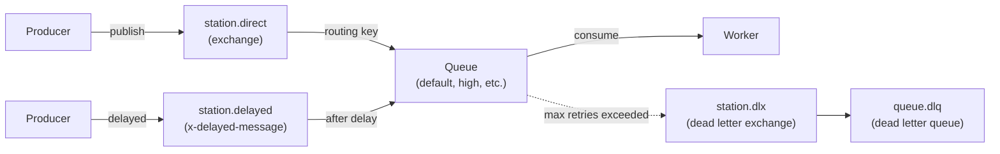

# Queue Drivers

Station supports five queue drivers. Each driver implements `Station\Contracts\DriverInterface` and is registered via the `Driver` enum (`Station\Enums\Driver`).

---

## Feature Matrix

| Feature | RabbitMQ | Redis | SQS | Beanstalkd | Kafka |
|---|:---:|:---:|:---:|:---:|:---:|
| **Phase** | 1.0 | 2.1 | 2.2 | 2.3 | 2.4 |
| **Maturity** | Production | Best-effort | Best-effort | Best-effort | Best-effort |
| | | | | | |
| **Delayed Jobs** | Native (plugin) | Native (sorted set) | Native (max 15 min) | Native | Database polling |
| **Dead Letter Queue** | Native (DLX) | Custom (Redis list) | Native (separate queue) | Buried jobs | Separate topic |
| **Priority Queues** | Via multiple queues | Via multiple queues | Via message attributes | Native (0-4B) | Via partitioning |
| **FIFO Ordering** | Best-effort | Per-instance | Native (.fifo queues) | Native | Per-partition |
| **Message Durability** | Disk-persisted | In-memory (optional RDB/AOF) | AWS-managed | Disk-persisted | Disk-persisted |
| **Message Acknowledgment** | Manual ACK | Implicit (list removal) | Visibility timeout + delete | Reserved state + delete | Offset commit |
| **SSL/TLS** | Yes | Yes (via Redis config) | Yes (AWS default) | No | Yes (SASL_SSL) |
| **Authentication** | User/password | Password (Redis AUTH) | AWS IAM + keys | None | SASL (PLAIN, SCRAM) |
| **Queue Size Inspection** | Exact | Exact | Approximate | Exact | Approximate (watermarks) |
| **Pause/Resume** | Yes (DB flag) | Yes (Redis key + DB) | Yes (DB flag) | Native (`pauseTube`) | Yes (DB flag) |
| **Clustering / HA** | Native clustering | Sentinel / Cluster | AWS multi-AZ | No | Multi-broker |
| **Max Message Size** | 128 MB | 512 MB | 256 KB | 64 KB | 1 MB (configurable) |
| | | | | | |
| **Batch Support** | Yes | Yes | Yes | Yes | Yes |
| **Workflow Support** | Yes | Yes | Yes | Yes | Yes |
| **Rate Limiting** | Yes (app-level) | Yes (app-level) | Yes (app-level) | Yes (app-level) | Yes (app-level) |
| **Backpressure** | Yes (app-level) | Yes (app-level) | Yes (app-level) | Yes (app-level) | Yes (app-level) |
| **Checkpointing** | Yes | Yes | Yes | Yes | Yes |
| **Metrics/Monitoring** | Yes | Yes | Yes | Yes | Yes |

---

## Driver-Specific Capabilities

### Delayed Jobs

| Driver | Implementation | Max Delay | Accuracy |
|---|---|---|---|
| RabbitMQ | `x-delayed-message` exchange plugin | 24 hours (configurable) | High (milliseconds) |
| Redis | Sorted set (`ZADD`) with timestamp | Unlimited | High (seconds) |
| SQS | `DelaySeconds` API parameter | 15 minutes (AWS hard limit) | Medium (seconds) |
| Beanstalkd | Native `put()` with delay | Unlimited | High (seconds) |
| Kafka | Database table `station_kafka_delayed_jobs` | Unlimited | Medium (polling-based) |

### Dead Letter Queues

| Driver | DLQ Type | DLQ Name Pattern | Default TTL |
|---|---|---|---|
| RabbitMQ | Exchange + queue (`x-dead-letter-exchange`) | `{queue}.dlq` | 7 days |
| Redis | Redis list | `queues:{queue}:failed` | Manual cleanup |
| SQS | Separate SQS queue | `{queue}-dlq` | Queue-configured |
| Beanstalkd | Buried job state | Same tube | Beanstalkd retention |
| Kafka | Separate Kafka topic | `{queue}.dlq` | Topic retention policy |

### Acknowledgment Models

| Driver | On Success | On Failure | Timeout Mechanism |
|---|---|---|---|
| RabbitMQ | `ack()` explicitly | `nack()` with requeue or DLX | Consumer prefetch |
| Redis | Removed on pop | `pushRaw()` to re-queue | No native timeout |
| SQS | `deleteMessage()` | `changeVisibility()` to reset | Visibility timeout (default 30s) |
| Beanstalkd | `delete()` explicitly | `release()` or `bury()` | TTR (default 60s) |
| Kafka | Offset `commit()` | `pushRaw()` to re-publish | Session timeout (default 30s) |

---

## Known Limitations

| Driver | Limitation | Impact |
|---|---|---|
| **SQS** | Max 15-minute delay | Longer delays require workaround |
| **Kafka** | No native delayed messages | Database polling adds latency |
| **Kafka** | Cannot clear topic (immutable) | `clear()` only clears delayed jobs table |
| **Kafka** | No exact queue size | Approximated via watermark offsets |
| **Beanstalkd** | No SSL/TLS | Requires reverse proxy for encryption |
| **Beanstalkd** | No clustering | Single node only, no HA |
| **Redis** | Durability depends on Redis config | Data loss possible if not using AOF |

---

## When to Use Each Driver

| Driver | Best For | Avoid When |
|---|---|---|
| **RabbitMQ** | Production workloads, message durability, advanced routing, compliance | Simple projects that don't need broker features |
| **Redis** | Low-latency, existing Redis infrastructure, simple deployments | Strict durability requirements, very large message volumes |
| **SQS** | AWS-native apps, managed service, serverless scaling | Jobs needing >15-min delays, non-AWS environments |
| **Beanstalkd** | Lightweight deployments, native priority queues | HA/clustering requirements, TLS encryption needed |
| **Kafka** | High-throughput event streaming, multi-consumer patterns | Simple queue use cases, delay-heavy workloads |

---

## RabbitMQ

The primary driver with the richest feature set.

**Message flow:**



**Exchanges:**

| Exchange | Type | Purpose |
|---|---|---|
| `station.direct` | direct | Main exchange - routes messages to queues by routing key |
| `station.delayed` | x-delayed-message | Delayed message delivery (requires plugin) |
| `station.dlx` | direct | Dead letter exchange for failed messages |

**Queue arguments set by Station:**

| Argument | Value | Purpose |
|---|---|---|
| `x-dead-letter-exchange` | `station.dlx` | Routes failed messages to DLX |
| `x-dead-letter-routing-key` | `{queue}.dlq` | DLQ routing key per queue |
| `x-message-ttl` | Configurable | Message time-to-live |

**Delayed messages** require the `rabbitmq_delayed_message_exchange` plugin. Station publishes to `station.delayed` with a `x-delay` header (milliseconds). Maximum delay: 24 hours (configurable).

**Dead letter queues** automatically receive messages that:
- Exceed max retry attempts
- Are rejected without requeue
- Expire via TTL

DLQ messages are retained for 7 days by default (configurable via `dead_letter.ttl`), with a max queue size of 10,000.

**Connection features:**
- Multi-host failover (tries each host until one succeeds)
- Lazy connection initialization
- Automatic reconnection on channel/connection loss
- SSL/TLS support with client certificates
- Heartbeat keep-alive (default: 60s)

**Configuration:**

```php
'rabbitmq' => [
    'driver' => 'rabbitmq',
    'hosts' => [
        [
            'host' => env('RABBITMQ_HOST', 'rabbitmq'),
            'port' => (int) env('RABBITMQ_PORT', 5672),
            'username' => env('RABBITMQ_USER', 'station'),
            'password' => env('RABBITMQ_PASSWORD', 'station'),
            'vhost' => env('RABBITMQ_VHOST', 'station'),
        ],
    ],
    'options' => [
        'ssl_options' => [
            'cafile' => env('RABBITMQ_SSL_CAFILE'),
            'local_cert' => env('RABBITMQ_SSL_LOCALCERT'),
            'local_key' => env('RABBITMQ_SSL_LOCALKEY'),
            'verify_peer' => env('RABBITMQ_SSL_VERIFY_PEER', true),
            'passphrase' => env('RABBITMQ_SSL_PASSPHRASE'),
        ],
        'heartbeat' => 60,
        'connection_timeout' => 10.0,
        'read_write_timeout' => 30.0,
    ],
    'exchange' => [
        'name' => env('RABBITMQ_EXCHANGE', 'station.direct'),
        'type' => env('RABBITMQ_EXCHANGE_TYPE', 'direct'),
        'durable' => true,
        'auto_delete' => false,
    ],
],
```

**Requirements:** `ext-amqp` PHP extension

---

## Redis

Best-effort compatibility with Horizon's Redis queues.

```php
'redis' => [
    'driver' => 'station-redis',
    'connection' => env('STATION_REDIS_CONNECTION', 'default'),
    'queue' => env('STATION_REDIS_QUEUE', 'default'),
    'retry_after' => (int) env('STATION_REDIS_RETRY_AFTER', 90),
    'block_for' => (int) env('STATION_REDIS_BLOCK_FOR', 5),
    'after_commit' => false,
],
```

**Requirements:** `ext-redis` or `predis/predis`

---

## Amazon SQS

AWS-native queue driver with FIFO queue support and LocalStack compatibility for local development.

```php
'sqs' => [
    'driver' => 'station-sqs',
    'key' => env('AWS_ACCESS_KEY_ID'),
    'secret' => env('AWS_SECRET_ACCESS_KEY'),
    'token' => env('AWS_SESSION_TOKEN'),
    'region' => env('AWS_DEFAULT_REGION', 'us-east-1'),
    'prefix' => env('SQS_PREFIX', 'https://sqs.us-east-1.amazonaws.com/your-account-id'),
    'suffix' => env('SQS_SUFFIX'),
    'queue' => env('SQS_QUEUE', 'default'),
    'endpoint' => env('SQS_ENDPOINT'),              // For LocalStack
    'wait_time' => (int) env('SQS_WAIT_TIME', 20),  // Long polling
    'visibility_timeout' => (int) env('SQS_VISIBILITY_TIMEOUT', 30),
    'fifo' => (bool) env('SQS_FIFO', false),
    'message_group_id' => env('SQS_MESSAGE_GROUP_ID', 'default'),
    'content_based_deduplication' => (bool) env('SQS_CONTENT_DEDUP', false),
    'after_commit' => false,
],
```

**Requirements:** `aws/aws-sdk-php`

---

## Beanstalkd

Lightweight driver with native job priority support.

```php
'beanstalkd' => [
    'driver' => 'station-beanstalkd',
    'host' => env('BEANSTALKD_HOST', '127.0.0.1'),
    'port' => (int) env('BEANSTALKD_PORT', 11300),
    'queue' => env('BEANSTALKD_QUEUE', 'default'),
    'timeout' => (int) env('BEANSTALKD_TIMEOUT', 10),
    'ttr' => (int) env('BEANSTALKD_TTR', 60),                     // Time-to-run
    'reserve_timeout' => (int) env('BEANSTALKD_RESERVE_TIMEOUT', 5),
    'priority' => (int) env('BEANSTALKD_PRIORITY', 1024),
    'retry_delay' => (int) env('BEANSTALKD_RETRY_DELAY', 60),
    'after_commit' => false,
],
```

**Requirements:** `pda/pheanstalk`

---

## Apache Kafka

High-throughput event streaming driver with SASL authentication and idempotent producer support.

```php
'kafka' => [
    'driver' => 'station-kafka',
    'brokers' => env('KAFKA_BROKERS', '127.0.0.1:9092'),
    'queue' => env('KAFKA_TOPIC', 'default'),
    'group_id' => env('KAFKA_GROUP_ID', 'station'),
    'auto_offset_reset' => env('KAFKA_AUTO_OFFSET_RESET', 'earliest'),
    'auto_commit' => (bool) env('KAFKA_AUTO_COMMIT', false),
    'consume_timeout' => (int) env('KAFKA_CONSUME_TIMEOUT', 5000),
    'flush_timeout' => (int) env('KAFKA_FLUSH_TIMEOUT', 10000),
    'session_timeout' => (int) env('KAFKA_SESSION_TIMEOUT', 30000),
    'heartbeat_interval' => (int) env('KAFKA_HEARTBEAT_INTERVAL', 3000),
    'message_timeout' => (int) env('KAFKA_MESSAGE_TIMEOUT', 30000),
    'acks' => (int) env('KAFKA_ACKS', -1),             // -1 = all replicas
    'idempotent' => (bool) env('KAFKA_IDEMPOTENT', false),
    'security_protocol' => env('KAFKA_SECURITY_PROTOCOL'),  // SASL_SSL, SASL_PLAINTEXT
    'sasl_mechanisms' => env('KAFKA_SASL_MECHANISMS'),
    'sasl_username' => env('KAFKA_SASL_USERNAME'),
    'sasl_password' => env('KAFKA_SASL_PASSWORD'),
    'after_commit' => false,
],
```

**Requirements:** `ext-rdkafka`
