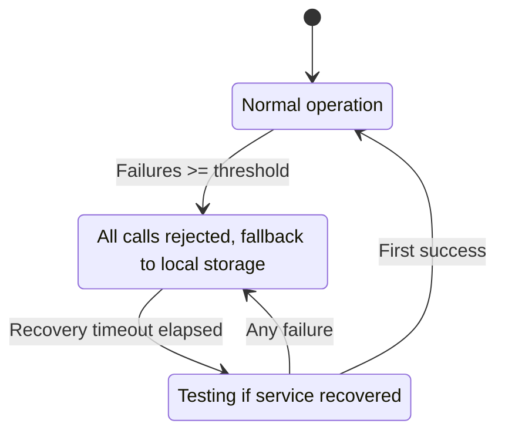

# Security, Alerting & Resilience

---

## Security

### API Authentication

The REST API at `/api/station/` (configurable via `station.api.prefix`) uses Bearer token authentication:

```
Authorization: Bearer your-api-token
```

Alternatively, pass the token as a query parameter: `?api_token=your-api-token`.

Token validation uses `hash_equals()` for constant-time comparison (prevents timing attacks). Rate limiting is applied per IP at 240 requests per minute by default.

**Configuration:**

```php
'api' => [
    'enabled' => true,
    'prefix' => 'api/station',
    'middleware' => ['api'],
    'auth' => env('STATION_API_AUTH', 'token'),  // 'token' or 'none'
    'token' => env('STATION_API_TOKEN'),
    'rate_limit' => 240,
],
```

### Dashboard Authorization

The dashboard uses Laravel's gate system for access control. Configure the `authorization` gate in `config/station.php`:

```php
// config/station.php
'dashboard' => [
    'authorization' => 'viewStation', // Gate name to check
],
```

Then define the gate in your `AuthServiceProvider`:

```php
Gate::define('viewStation', function ($user) {
    return in_array($user->email, ['admin@example.com']);
});
```

In local environments (`APP_ENV=local`), the dashboard is accessible without authentication.

The dashboard middleware stack is configurable:

```php
'dashboard' => [
    'middleware' => ['web', 'auth'],
],
```

### Job Encryption

Laravel's built-in `ShouldBeEncrypted` interface encrypts job payloads. Station records these payloads as-is in `station_jobs`, so they remain encrypted at rest:

```php
use Illuminate\Contracts\Queue\ShouldBeEncrypted;

class SensitiveJob implements ShouldQueue, ShouldBeEncrypted
{
    // Payload is encrypted by Laravel before storage and decrypted at execution time
}
```

**Configuration:**

```php
'encryption' => [
    'enabled' => true,
    'key' => env('STATION_ENCRYPTION_KEY'),  // Falls back to APP_KEY if not set
    'cipher' => 'aes-256-gcm',
],
```

Checkpoint data is also encrypted by default (`STATION_CHECKPOINT_ENCRYPT=true`).

### Payload Masking

Jobs implementing `ShouldMaskPayload` define which fields are redacted in the dashboard and logs:

```php
use Station\Contracts\ShouldMaskPayload;

class ProcessPaymentJob implements ShouldQueue, ShouldMaskPayload
{
    public function maskedFields(): array
    {
        return ['credit_card', 'cvv', 'billing.address'];  // Supports dot notation
    }
}
```

Station also applies global masking rules to all jobs:

```php
'masking' => [
    'enabled' => env('STATION_MASKING_ENABLED', true),
    'fields' => [
        'password', 'secret', 'token',
        'api_key', 'credit_card', 'ssn',
    ],
    'replacement' => '[REDACTED]',
],
```

### Audit Logging

Every administrative action through the dashboard or API is recorded in `station_audit_log`:

- Job retry, cancel, delete
- Batch cancel, retry
- Queue pause, resume
- Workflow pause, resume, cancel
- Stuck job recovery

```php
'audit' => [
    'enabled' => env('STATION_AUDIT_ENABLED', true),
    'driver' => env('STATION_AUDIT_DRIVER', 'database'),
    'retention_days' => (int) env('STATION_AUDIT_RETENTION_DAYS', 90),
],
```

### Security Headers

When enabled, Station adds security headers to all dashboard responses:

```php
'security_headers' => env('STATION_SECURITY_HEADERS', true),
```

---

## Alerting

Station includes built-in alerting with configurable channels and rules.

### Alert Channels

| Channel | Configuration | Description |
|---|---|---|
| **Slack** | `STATION_ALERT_SLACK_WEBHOOK` | Sends notifications via Slack incoming webhook |
| **Discord** | `STATION_ALERT_DISCORD_WEBHOOK` | Sends notifications via Discord webhook |
| **Teams** | `STATION_ALERT_TEAMS_WEBHOOK` | Sends notifications via Microsoft Teams webhook |
| **Google Chat** | `STATION_ALERT_GOOGLE_CHAT_WEBHOOK` | Sends notifications via Google Chat webhook |
| **Email** | `STATION_ALERT_EMAIL` | Comma-separated recipient addresses |
| **Webhook** | `STATION_ALERT_WEBHOOK_URL` | Sends JSON payload to a custom webhook URL |
| **Log** | `station-alerts` channel | Writes to a dedicated log channel |

### Alert Rules

Each rule defines a condition, monitoring window, notification channels, and cooldown period:

| Rule | Condition | Default Cooldown | Description |
|---|---|---|---|
| `high_failure_rate` | `failure_rate > 10%` | 15 min | Triggers when failure rate exceeds threshold within a 5-minute window |
| `queue_backup` | `queue_size > 10,000` | 10 min | Triggers when queue depth exceeds threshold (configurable per queue) |
| `stuck_jobs` | `stuck_count > 0` | 5 min | Triggers when any stuck jobs are detected |
| `worker_down` | `active_workers < 1` | 1 min | Triggers when no workers are running |

**Configuration:**

```php
'alerts' => [
    'enabled' => env('STATION_ALERTS_ENABLED', false),

    'channels' => [
        ['name' => 'Default Slack', 'type' => 'slack', 'config' => ['webhook_url' => env('STATION_ALERT_SLACK_WEBHOOK', '')]],
        ['name' => 'Default Email', 'type' => 'email', 'config' => ['recipients' => array_filter(explode(',', env('STATION_ALERT_EMAIL', '')))]],
        ['name' => 'Station Log', 'type' => 'log', 'config' => ['channel' => 'station-alerts']],
        ['name' => 'Default Discord', 'type' => 'discord', 'config' => ['webhook_url' => env('STATION_ALERT_DISCORD_WEBHOOK', '')]],
        ['name' => 'Default Teams', 'type' => 'teams', 'config' => ['webhook_url' => env('STATION_ALERT_TEAMS_WEBHOOK', '')]],
        ['name' => 'Default Google Chat', 'type' => 'google_chat', 'config' => ['webhook_url' => env('STATION_ALERT_GOOGLE_CHAT_WEBHOOK', '')]],
        ['name' => 'Default Webhook', 'type' => 'webhook', 'config' => ['url' => env('STATION_ALERT_WEBHOOK_URL', ''), 'secret' => env('STATION_ALERT_WEBHOOK_SECRET')]],
    ],

    'rules' => [
        'high_failure_rate' => [
            'enabled' => true,
            'condition' => 'failure_rate > 10',
            'window' => 300,
            'channels' => ['slack', 'email'],
            'cooldown' => 900,
        ],
        'queue_backup' => [
            'enabled' => true,
            'condition' => 'queue_size > 10000',
            'queues' => ['high', 'default'],
            'channels' => ['slack'],
            'cooldown' => 600,
        ],
        'stuck_jobs' => [
            'enabled' => true,
            'condition' => 'stuck_count > 0',
            'channels' => ['slack', 'email'],
            'cooldown' => 300,
        ],
        'worker_down' => [
            'enabled' => true,
            'condition' => 'active_workers < 1',
            'channels' => ['slack', 'email'],
            'cooldown' => 60,
        ],
    ],
],
```

Maintenance mode can also trigger notifications:

```php
'maintenance' => [
    'notify_on_pause' => true,
    'notify_channels' => ['slack'],
],
```

---

## Circuit Breaker

Station implements a circuit breaker pattern for external service connections (queue drivers, database). When a service fails repeatedly, the circuit opens and Station falls back to local storage.



```php
'circuit_breaker' => [
    'enabled' => true,

    'services' => [
        'rabbitmq' => [
            'failure_threshold' => 5,    // Failures before opening
            'recovery_timeout' => 30,    // Seconds before half-open
            'timeout' => 5,
        ],
        'database' => [
            'failure_threshold' => 3,
            'recovery_timeout' => 15,
        ],
    ],

    'fallback' => [
        'strategy' => 'queue_locally',
        'local_storage' => storage_path('station/fallback'),
        'max_local_jobs' => 10000,
    ],
],
```

When the circuit is open, jobs are stored locally and replayed when the circuit closes.

---

## Rate Limiting and Backpressure

### Rate Limiting

Limit how fast jobs are processed per queue:

```php
'rate_limiting' => [
    'enabled' => true,
    'driver' => env('STATION_RATE_LIMIT_DRIVER', 'cache'),
    'limits' => [],
    'on_limit' => 'release',     // Release back to queue
    'release_delay' => 30,       // Seconds before retrying
],
```

### Backpressure

Prevent queues from growing unbounded:

```php
'backpressure' => [
    'enabled' => false,
    'default_max_size' => 100000,
    'default_on_full' => 'reject',  // 'reject', 'drop_oldest', 'overflow_to_dlq'
    'limits' => [],
],
```

When a queue reaches its max size, new jobs are either rejected, the oldest jobs are dropped, or overflow is routed to the dead letter queue.
